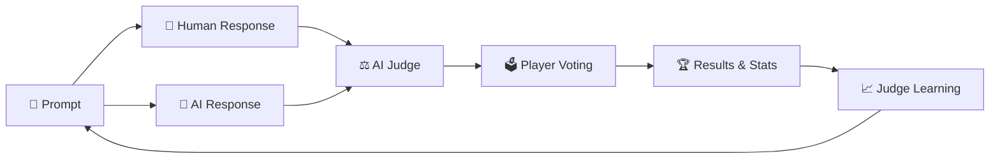

# 🎭 Reverse Turing Game: AI Lie Detector

<div align="center">


**The ultimate social deception game where humans battle AI in a test of wit and creativity!**

[🎮 Quick Start](#-quick-start) • [🏗️ Architecture](#️-architecture) • [🚀 Deployment](#-deployment) • [📖 Documentation](#-documentation)

</div>

---

## 🌟 What is Reverse Turing Game?

Reverse Turing Game flips the classic Turing Test on its head! It's a **multiplayer social web game** where humans try to fool an AI judge while simultaneously trying to detect AI-generated responses. Think "Among Us" meets AI research – players compete in real-time to be the best **human impersonator** and **AI detector**.

### 🎯 Core Gameplay Loop



1. **📝 Respond**: Write responses to prompts, trying to sound human
2. **🕵️ Detect**: Vote on which responses are human vs AI-generated  
3. **⚖️ Judge**: AI analyzes responses and makes predictions
4. **🎭 Reveal**: See results with detailed AI reasoning
5. **📈 Learn**: AI judge improves from mistakes via fine-tuning
6. **🏆 Compete**: Climb leaderboards across themed rooms

---

## ✨ Features

<table>
<tr>
<td width="50%">

### 🎮 **Core Game Features**
- 🎭 **Real-time multiplayer** rooms with live WebSocket updates
- 🤖 **Dual AI System**: Judge (Phi-3.5) + Responder (Qwen-2.5)
- 🎨 **Themed Rooms**: Poetry, Debate, Personal, Creative writing
- ⏱️ **Timed Rounds**: Response (90s) and voting (30s) phases
- 🏆 **Dynamic Leaderboards** with multiple scoring categories
- 📊 **Live Analytics** dashboard with performance metrics

</td>
<td width="50%">

### 🧠 **AI & Research Features**
- 🎯 **Continuous Learning**: Judge improves via LoRA fine-tuning
- 📈 **Performance Tracking**: Real-time accuracy monitoring
- 🎪 **Style Cloaks**: Modify writing styles for difficulty
- 🔍 **Transparent AI**: See judge reasoning and confidence
- 📚 **Research Data**: Generate valuable AI detection datasets
- 🚀 **Model Versioning**: Track judge improvements over time

</td>
</tr>
</table>

---

## 🚀 Quick Start

### ⚡ One-Command Launch
```bash
./start_game.sh
```
**That's it!** The script automatically:
- 🐳 Starts PostgreSQL & Redis with Docker
- 🐍 Sets up Python virtual environment  
- 📦 Installs all dependencies
- 🗃️ Initializes database with sample data
- 🚀 Launches backend and frontend servers
- 🌐 Opens game in your browser

### 🎮 Access Your Game
- **Frontend**: http://localhost:3000 (React app)
- **Backend**: http://localhost:5000 (Flask API)
- **Database**: localhost:5432 (PostgreSQL)
- **Cache**: localhost:6379 (Redis)

### 🛑 Stop Everything
```bash
./stop_game.sh
```

---

## 🏗️ Architecture

### 🎯 **System Overview**

```
                🌐 Frontend (React + TypeScript)
                ├── 🎨 Tailwind CSS + Responsive Design
                ├── 🔌 Socket.IO Real-time Communication  
                ├── 🛡️ Authentication Context
                └── 📊 Analytics Dashboard

                     ⬇️ WebSocket + REST API

                🚀 Backend (Flask + Python)
                ├── 🔌 Flask-SocketIO (Real-time)
                ├── 🗃️ PostgreSQL (Game Data)
                ├── ⚡ Redis (Sessions + Cache)
                ├── 🤖 AI Models (Judge + Responder)
                └── 🔄 Celery (Background Training)

                     ⬇️ Model Inference

                🧠 AI Components
                ├── ⚖️ Judge AI (Phi-3.5-mini-instruct)
                ├── 🤖 Responder AI (Qwen2.5-1.5B-Instruct) 
                ├── 🎯 LoRA Fine-tuning Pipeline
                └── 📈 Performance Analytics
```

### 📊 **Tech Stack**

<table>
<tr>
<th>Layer</th>
<th>Technology</th>
<th>Purpose</th>
</tr>
<tr>
<td><strong>Frontend</strong></td>
<td>React 18, TypeScript, Tailwind CSS</td>
<td>Modern responsive UI with real-time updates</td>
</tr>
<tr>
<td><strong>Backend</strong></td>
<td>Flask, Flask-SocketIO, SQLAlchemy</td>
<td>WebSocket server with REST API</td>
</tr>
<tr>
<td><strong>Database</strong></td>
<td>PostgreSQL, Redis</td>
<td>Persistent storage + session cache</td>
</tr>
<tr>
<td><strong>AI Models</strong></td>
<td>HuggingFace Transformers, PEFT</td>
<td>Judge & responder LLMs with fine-tuning</td>
</tr>
<tr>
<td><strong>Training</strong></td>
<td>Celery, LoRA/QLoRA</td>
<td>Continuous model improvement</td>
</tr>
<tr>
<td><strong>Infrastructure</strong></td>
<td>Docker, Docker Compose</td>
<td>Containerized development & deployment</td>
</tr>
</table>

---

## 🎮 How to Play

### 1. 🎭 **Deception Phase** (90 seconds)
Write a response to the given prompt, trying to sound as human as possible. Use personal experiences, imperfections, and emotional touches to fool the AI judge.

### 2. 🕵️ **Detection Phase** (30 seconds)  
After responses are collected, vote on which response was written by a human. Look for telltale signs of AI generation like perfect grammar or generic responses.

### 3. ⚖️ **Judgment Phase**
The AI judge analyzes both responses and predicts which is human with confidence scores and detailed reasoning.

### 4. 🎉 **Results Phase**
See the reveal! Learn from the AI's reasoning and discover who fooled whom. Gain points for successful deception and accurate detection.

### 🏆 **Scoring System**
- **Deception Score**: How often you fool the AI judge
- **Detection Score**: How accurately you identify AI responses  
- **Overall Score**: Combined performance metric
- **Achievements**: Unlock badges for milestones

---

## 🏠 Themed Rooms

<table>
<tr>
<td width="25%" align="center">
<h3>📝 Poetry</h3>
Express emotions through verse<br/>
<em>"Write a haiku about technology"</em>
</td>
<td width="25%" align="center">
<h3>💬 Debate</h3>
Argue positions persuasively<br/>
<em>"Should AI have rights?"</em>
</td>
<td width="25%" align="center">
<h3>👤 Personal</h3>
Share life experiences<br/>
<em>"Your most embarrassing moment"</em>
</td>
<td width="25%" align="center">
<h3>🎨 Creative</h3>
Imaginative storytelling<br/>
<em>"World where gravity is reversed"</em>
</td>
</tr>
</table>

---

## 🤖 AI Technology

### ⚖️ **Judge AI** (Microsoft Phi-3.5-mini-instruct)
- **Purpose**: Detect human vs AI-generated text
- **Features**: Confidence scoring + detailed reasoning
- **Learning**: Continuously improves via LoRA fine-tuning
- **Accuracy**: Targets 75%+ after 1000 games

### 🤖 **Responder AI** (Qwen2.5-1.5B-Instruct)  
- **Purpose**: Generate competitive responses to fool the judge
- **Features**: Humanization post-processing, style variation
- **Strategy**: Different model family to avoid detection bias
- **Difficulty**: Adaptive challenge based on judge performance

### 🎯 **Continuous Learning Pipeline**
1. **Data Collection**: Misclassified examples from gameplay
2. **Batch Processing**: Accumulate training examples  
3. **LoRA Fine-tuning**: Efficient parameter adaptation
4. **Model Deployment**: Hot-swap updated judge models
5. **Performance Tracking**: Monitor accuracy improvements

---

## 🚀 Deployment

### 💻 **Local Development**
```bash
# Clone and start
git clone <repository>
cd reverse-turing-game
./start_game.sh
```

### 🐳 **Docker Production**
```bash
# Production deployment
docker-compose -f docker-compose.prod.yml up -d
```

### ☁️ **Cloud Deployment**
The game is cloud-ready with support for:
- **Frontend**: Vercel, Netlify, AWS S3
- **Backend**: AWS EC2, Google Cloud Run, Heroku
- **Database**: AWS RDS, Google Cloud SQL
- **Models**: HuggingFace Inference API, AWS SageMaker

---

## 📊 Analytics & Insights

### 🎯 **Game Metrics**
- Judge accuracy trends over time
- Human vs AI win rates by room type  
- Player engagement and session length
- Model performance and learning rate

### 🔬 **Research Applications**
- Generate labeled datasets for AI detection research
- Study human vs AI writing patterns
- Analyze judge decision-making processes
- Track adversarial training effectiveness

---

## 🛠️ Configuration

### 📋 **System Requirements**
- **Python**: 3.9+ with pip
- **Node.js**: 18+ with npm  
- **Docker**: For PostgreSQL & Redis
- **Memory**: 4GB+ RAM (8GB+ for AI models)
- **GPU**: Optional NVIDIA GPU for faster inference

### ⚙️ **Environment Setup**
```bash
# Copy example environment
cp backend/.env.example backend/.env

# Edit configuration
vim backend/.env
```

### 🔧 **Key Settings**
- **Models**: Configure different judge/responder models
- **Timing**: Adjust response and voting timeouts
- **Difficulty**: Tune judge confidence thresholds
- **Rooms**: Add custom prompt themes

---

## 🤝 Contributing

We welcome contributions! Here's how to get started:

1. **🍴 Fork** the repository
2. **🌱 Create** a feature branch (`git checkout -b feature/amazing-feature`)  
3. **💾 Commit** your changes (`git commit -m 'Add amazing feature'`)
4. **🚀 Push** to the branch (`git push origin feature/amazing-feature`)
5. **📬 Open** a Pull Request

### 🎯 **Contribution Areas**
- 🎨 New UI components and themes
- 🤖 Additional AI models and prompts  
- 📊 Analytics features and visualizations
- 🔧 Performance optimizations
- 🐛 Bug fixes and testing

---

## 📖 Documentation

### 📚 **Additional Resources**
- [📋 API Documentation](docs/api.md) - Complete backend API reference
- [🎮 Game Rules](docs/gameplay.md) - Detailed gameplay mechanics  
- [🤖 AI Models](docs/models.md) - Technical model documentation
- [🚀 Deployment Guide](docs/deployment.md) - Production setup instructions
- [🔧 Configuration](docs/configuration.md) - Environment and settings

### 🆘 **Support**
- **🐛 Bug Reports**: Open an issue with detailed reproduction steps
- **💡 Feature Requests**: Describe your idea and use case
- **❓ Questions**: Check existing issues or start a discussion
- **📧 Contact**: [Your contact information]

---

## 📜 License

This project is licensed under the MIT License - see the [LICENSE](LICENSE) file for details.

---

## 🎉 Fun Facts

- 🏆 **Research Impact**: Generates valuable AI detection datasets for the research community
- 🎮 **Addictive Gameplay**: Average session length targets 15+ minutes
- 🤖 **AI vs AI**: Sometimes the AI responder fools the AI judge!
- 📈 **Learning Curve**: Judge accuracy improves 2-5% per training cycle
- 🌍 **Global Competition**: Leaderboards across different writing styles and cultures

---

<div align="center">

**🎭 Ready to fool some AI? Let the games begin! 🎮**

[🚀 Start Playing](#-quick-start) • [⭐ Star on GitHub](https://github.com/skeehn/reverseturing) • [🤝 Contribute](#-contributing)

---

*Built with ❤️ for the AI research community and gaming enthusiasts worldwide*

</div>
